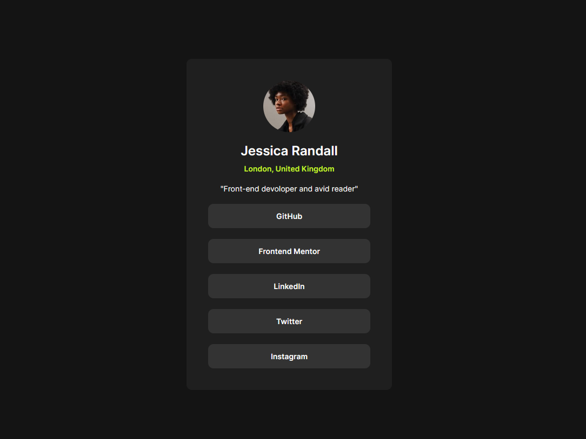
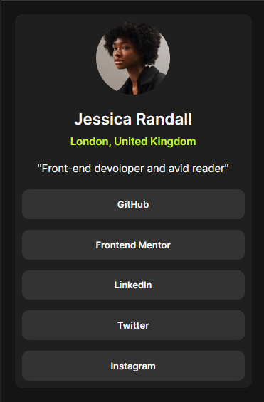

# Frontend Mentor - Social links profile solution

This is a solution to the [Social links profile challenge on Frontend Mentor](https://www.frontendmentor.io/challenges/social-links-profile-UG32l9m6dQ). 

## Table of contents

- [Overview](#overview)
  - [Screenshot](#screenshot)
  - [Links](#links)
- [My process](#my-process)
  - [Built with](#built-with)
  - [What I learned](#what-i-learned)
- [Author](#author)

## Overview

Layout from Frontend Mentor. A responsive page with a centered simple user profile block with an social media link buttons.

### Screenshot

Desktop 1440px

Mobile 370px

### Links

- Solution URL: [GitHub](https://github.com/BogdanSDev/Social-links-profile-Frontend-Mentor)
- Live Site URL: [GitHub Pages](https://bogdansdev.github.io/Social-links-profile-Frontend-Mentor/)

## My process

### Built with

- Semantic HTML5 markup
- CSS custom properties
- CSS BEM convention
- Flexbox layout

### What I learned

 - Aligning blocks and text using flexbox
 - Sematic HTML markup
 - Responsive layout using vm.
 - Normalizing CSS styles
 - Working with media queries
 - Git basics

## Author
Bogdan Sinitsyn
- GitHub - [BogdanSDev](https://github.com/BogdanSDev)
- Frontend Mentor - [@BogdanSDev](https://www.frontendmentor.io/profile/BogdanSDev)
